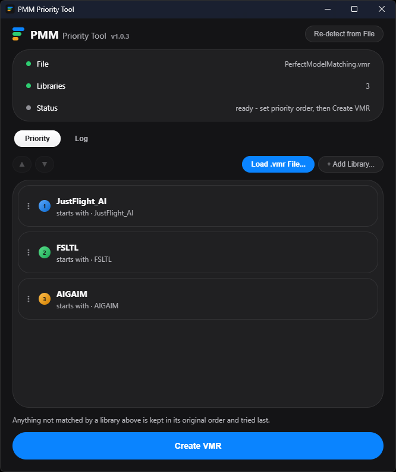
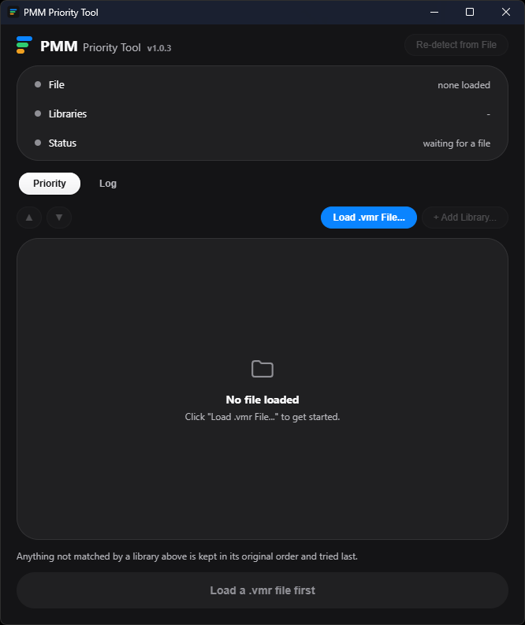

# PMM Priority Tool

A small Windows GUI tool for prioritizing AI traffic model libraries in [vPilot](https://vpilot.rosscarlson.dev/) custom rule sets, built around [Perfect Model Matching](https://flightsim.to/addon/81299/perfect-model-matching) (PMM) — a community-made `.vmr` creator that merges several AI traffic add-ons into one combined model-matching rule set.

<br clear="left">

<p align="center">
  
</p>

## Why this exists

PMM's merged `.vmr` lists candidates from multiple AI traffic add-ons together inside single rules (`ModelName="A//B//C"`), but vPilot picks **randomly** among the candidates in a rule like that — reordering that list does nothing. Real prioritization only happens *between* separate custom rule set files, which vPilot checks in the order you arrange them under **Settings > Model Matching > Custom Rules**.

This tool takes a merged `.vmr` file (like PMM's) and **splits it into one `.vmr` file per library** — e.g. `1 - FS_Traffic.vmr`, `2 - FSLTL.vmr`, `3 - AIG.vmr` — based on patterns you define, in whatever priority order you choose. Any model that doesn't match one of your defined libraries is written to a trailing `Other.vmr` instead of being dropped. Load all of the generated files into vPilot as separate custom rule sets in that same numeric order, once, and vPilot handles the actual priority/fallback behavior natively from then on.

## Features

- Read a `.vmr` file and auto-detect the AI traffic libraries it contains, by clustering model names on shared naming prefixes
- Reorder libraries by priority (highest first) with simple up/down controls
- Add your own custom library definitions (prefix or "contains" match on model name)
- Remembers the library list/order **per input file**, so reloading the same `.vmr` later restores your setup
- Excludes stub/placeholder models automatically
- Built-in auto-updater that checks GitHub Releases and installs updates in place
- Also runs headless from the command line for scripting

## Installation

Download the latest `PMM_Priority_Tool_Setup.exe` from [Releases](https://github.com/iFrezeTiger/PMM-Priority-Tool/releases) and run it. It's a per-user install — no admin rights required.

## Usage

<p align="center">
  
</p>

1. Open **PMM Priority Tool**.
2. Load your `.vmr` file (e.g. `PerfectModelMatching.vmr`).
3. Review the auto-detected libraries and reorder them by priority, adding any custom ones you need.
4. Click to split — the tool writes one numbered `.vmr` file per library into a `<your file>_split` folder next to the input file (the GUI doesn't currently offer a custom output location; use the CLI's `OUTPUT_DIR` argument for that).
5. In vPilot, go to **Settings > Model Matching (MSFS or MSFS 2024) > Custom Rules**, click **Add Custom Rule Set(s)**, select all the generated files, then use **Move Up / Move Down** so they match the numeric order shown in the filenames.

### Command line

```
PMM_Priority_Tool.exe INPUT.vmr [OUTPUT_DIR] [--order "Lib1,Lib2,..."]
```

Examples:

```
PMM_Priority_Tool.exe PerfectModelMatching.vmr
PMM_Priority_Tool.exe PerfectModelMatching.vmr --order "FSLTL,FS Traffic,AIG,GAmod"
PMM_Priority_Tool.exe PerfectModelMatching.vmr OUTPUT_DIR --order "AIG,FSLTL"
```

`--order` accepts labels from whichever library set applies to that input file — its saved configuration in `pmm_libraries.json` (kept next to the exe) if you've split it before, or the libraries auto-detected fresh from its contents otherwise — so it works with custom libraries too. Delete `pmm_libraries.json` to clear all saved per-file setups; the tool will auto-detect libraries from scratch next time.

## Building from source

Requires Python 3 on Windows.

```bash
pip install pywebview pyinstaller
python -m PyInstaller PMM_Priority_Tool.spec
```

The build lands at `dist\PMM_Priority_Tool\PMM_Priority_Tool.exe`. This is a one-directory build — the `_internal` folder must stay next to the exe, so share/zip the whole `dist\PMM_Priority_Tool` folder rather than just the exe.

To build the installer, compile `installer.iss` with [Inno Setup](https://jrsoftware.org/isinfo.php) after the PyInstaller build above; the output goes to `Installer\PMM_Priority_Tool_Setup.exe`.

Running the script directly (`python prioritize_vmr_standalone.py`) opens the GUI; passing a `.vmr` path as an argument runs it headless instead.

## Requirements

- Windows 10/11
- [Microsoft Edge WebView2 Runtime](https://developer.microsoft.com/microsoft-edge/webview2/) (preinstalled on virtually all Windows 10/11 machines since it ships with Edge)

## License

No license specified.
